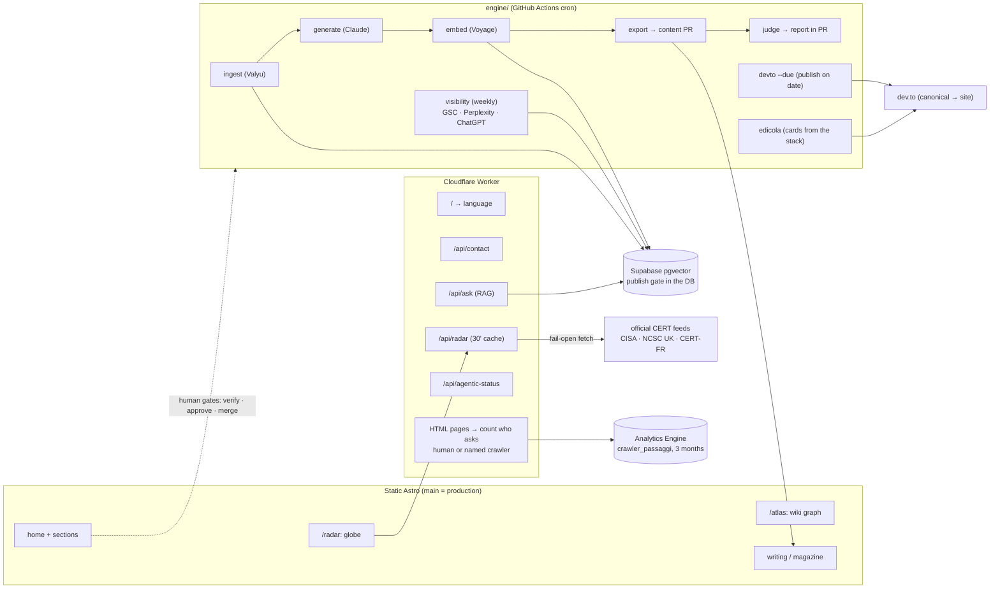

# marcobellingeri.dev

Personal site of **Marco Bellingeri**, Cloud Platform & AI Security Engineer.
Static Astro, bilingual EN/IT, with a monthly magazine fed by a RAG pipeline.

[](https://github.com/MK023/marcobellingeri.dev/actions/workflows/site-ci.yml)
[](https://github.com/MK023/marcobellingeri.dev/actions/workflows/backend-ci.yml)
[](https://sonarcloud.io/summary/overall?id=MK023_marcobellingeri.dev)
[](https://sonarcloud.io/component_measures?id=MK023_marcobellingeri.dev&metric=coverage)
[](LICENSE)

The site audits itself. The *Security* section does not declare the security headers, it
**reads them back out of the HTTP response** the browser has just received. That is why the
Content Security Policy in this repository is built from script hashes instead of
`unsafe-inline`, and why it is verified in CI against `dist/` rather than the source.

---

## Layout

| Directory | What it holds |
| --- | --- |
| `astro-project/` | The site. Static Astro, EN/IT i18n, components, CSP, tests. **Start here.** |
| `engine/` | The Node pipeline behind the monthly issue: sourcing, verification, generation, embed, export, judge (LLM-as-a-judge on the content PR), competitor radar. Plus distribution: `devto` (draft at merge, publish on the frontmatter `date`) and `edicola` (automatic cards). No external dependencies. |
| `supabase/` | Migrations, seed and RLS policies for the RAG database (Postgres + pgvector). Rebuildable from scratch. |
| `docs/adr/` | The architectural decisions and the reasoning. `docs/FONTI.md` holds the licence registry for the Radar sources, every one with a verified licence; the guard in CI runs on the machine-readable registry, `src/data/radar-fonti.js`. |
| `mock-html-singolo/` | The HTML prototype everything grew out of. Historical reference, not to be touched. |

## Running it

```bash
cd astro-project
npm install
npm run dev          # development
npm run check        # type-check the .astro files (strict tsconfig)
npm run lint         # ESLint, the only eyes on the .astro files
npm run build        # static build into dist/
npm run test:csp     # tests run against dist/, not the source
```

`check` and `lint` also run in CI **and on the path to deploy**, not just in `Site CI`. That
workflow is separate and the deploy does not wait for it, so a gate living only there would
stop nothing.

To serve the site **with the real headers**, the ones from `public/_headers` that
`astro preview` does not apply:

```bash
npx wrangler dev
```

The pipeline needs its secrets from Doppler:

```bash
cd engine
doppler run -- npm run ingest
npm test             # unit + integration, no network
```

### Checking it in a browser, reproducibly

`npm run test:csp` reads `dist/` — built HTML and JS. That catches everything visible in the
product of the build, and nothing about what happens when the code **runs**: a third-party script
arriving late, a widget not yet rendered, a callback that never fires. On 2026-09-04 a regression
on the contact form walked past 291 green tests and reached production for exactly that reason
(PR #272, repaired by #273).

```bash
docker compose up sito              # the site on :8788, Node pinned to CI's version
docker compose run --rm verifica    # the browser checks against it
```

The Worker runtime is **already** production-grade outside Docker — `wrangler dev` runs workerd,
the same engine Cloudflare runs — so the image does not add fidelity there, and the `Dockerfile`
says so. What it pins is the Node version and, the part that was missing, **the browser doing the
checking**.

The same script runs against a remote target, but it does **not** do the same work there:

```bash
docker compose run --rm -e BASE_URL=https://marcobellingeri.dev verifica
```

It runs from the container because Playwright lives only in the image — the repo has no root
`package.json`, so the same command on the host would fail to resolve it.

Against anything that is not localhost it runs the read-only checks only — no third party contacted
on load, no static `api.js` tag — and **skips pressing Send and running `ask`**. It has to: the
test-sitekey swap is local-only, so on the live site the token is genuine, passes `siteverify`, and
each run would deliver real email and spend real model budget. The script prints which of the two
modes it took.

Secrets come from the environment of whoever starts it, never from the image: `doppler run --
docker compose up sito`. Without them the site still serves — Turnstile verification is fail-open
with a Sentry alert when `TURNSTILE_SECRET_KEY` is missing.

One asymmetry is closed in code rather than here: the production Turnstile sitekey is bound to the
real hostname, so on `localhost` the widget never rendered and a genuine fault looked exactly like
"we are running locally". `src/lib/turnstile.ts` swaps in Cloudflare's test sitekey when the
hostname is local. An environment that cannot tell a defect from its own limitation only ever
confirms.

## Security

The CSP allows no `unsafe-inline` on `script-src`: bundled scripts are authorised by hash,
computed by Astro at build time, and the hash of the anti-FOUC script (which is `is:inline`,
so Astro leaves it alone) is declared by hand in `astro.config.mjs`. Change it and
`npm run test:csp` fails, telling you exactly which hash to use.

`frame-ancestors` is the only CSP directive left in `public/_headers`, because a `<meta>`
would ignore it by spec. Everything else lives in the meta tag generated at build time, the
only place where the hashes can be computed.

Other nets:

- **SonarQube Cloud quality gate on the path to deploy**: in `deploy.yml` the analysis job
  runs before publication (`sonar.qualitygate.wait=true`), so a red gate means no production.
  On PRs the analysis arrives as a check, while the change can still be discussed. Coverage
  is computed by the Node test runner, with no extra dependency.
- **`astro check` + ESLint**, because Sonar on its own left **more than half the site**
  uncovered: it has no Astro parser, and the 27 `.astro` files (roughly 4600 lines, more than
  everything Sonar does analyse) passed with no static checking at all. That is exactly where
  the browser-side logic lives: contact form, command palette, terminal. The `tsconfig` was
  already `strict`, but nobody ran it, which is decorative severity. **No Prettier**: it
  formats, it does not find bugs, and style arguments take two people. The ESLint config
  disables **no rules at all**. The only exception sits on the line itself with the
  reason next to it (the Worker's anti-header-injection regex, where control characters are
  the target rather than the mistake).
- **One list of security headers for everything the Worker generates**, in `worker/headers.js`.
  `public/_headers` covers static assets and the API responses never passed through it, so the
  list had been copied into four places and had started to drift. Two mirrors hold it: one test
  writes the five values out in full and checks the Worker's responses carry them, another reads
  `public/_headers` and fails if the two ever disagree.
- **A rate limit on the three routes that generate work** (`/api/contact`, `/api/ask`,
  `/api/agentic-status`), declared in `wrangler.jsonc` as a runtime binding rather than a WAF
  rule, so it is reviewed in a pull request like everything else. `/api/radar` has none: it is
  answered from the edge cache for half an hour at a time, so a flood costs one round of feeds. The counter is per Cloudflare
  location and eventually consistent by design: a ceiling against a flood from one source, not
  an exact quota. Verifying one needs every request on a single connection: spread them across
  parallel connections and each gets its own counter, so a working limit looks absent.
- **gitleaks** across the whole history on every push to `main`, and in a local pre-commit hook.
- **Push protection** from secret scanning: GitHub refuses a push containing a secret instead
  of discovering it afterwards.
- **RLS on every table**, verified in CI by rebuilding the database from scratch and making
  the *publish gate* bite. An issue cannot reach `published` without proof of its sources.
- Secrets on **Doppler**, never in the repository. `.env` is ignored.

### The pipeline level, declared

The pipeline stops at a **tailored Level 3** (blocking gates on both the application and the
supply chain), and every stop has a reason:

- **No human approval gate on production**: `main` *is* production, by choice. The cost of a
  mistake is low, the Cloudflare rollback is immediate, and the automatic gates (Sonar, CSP on
  dist, gitleaks, ruleset) all sit on the path to deploy.
- **No OIDC towards Cloudflare**: not out of laziness. Cloudflare does not expose OIDC
  federation for API tokens. The compensating control is a minimally scoped token. This is a
  declared ceiling, not debt.
- **No canary or progressive delivery**: at this traffic level a 5% canary cannot reach
  statistical significance before the rollout ends. Theatre, not a gate.
- **Active supply chain**: actions pinned to SHA (kept current by Dependabot), a CycloneDX
  SBOM on every deploy, a **signed provenance attestation** (keyless, OIDC) that is verified,
  SAST on the workflows themselves (zizmor, blocking on High), and minimal `GITHUB_TOKEN`
  permissions per job.
- **Gate policy**: every gate declares what it blocks in the comment beside it. A gate with no
  written policy is a future `continue-on-error`.

Vulnerabilities: **do not open a public issue**, see [SECURITY.md](SECURITY.md).

Enable the anti-secret hook once per clone:

```bash
git config core.hooksPath .githooks
brew install gitleaks
```

## Observability

Sentry, free plan, DE region. The principle: only turn on what, when it rings, says something
you would not have known otherwise.

- **Errors** on the client and the Worker. On the Worker, `withSentry` catches unhandled
  exceptions; the form's *handled* failures (Turnstile with no secret, Resend answering badly)
  go through the `__SEGNALA_SENTRY__` hook, because `withSentry` alone would never see them.
  They are `return`s, not `throw`s. On the client the SDK loads **lazily** (first interaction
  or first idle): its whole cost sat on the critical path and it was the last reason mobile
  TBT was not zero. Errors raised before it loads land in a buffer and leave as soon as the
  SDK arrives (`sentry.client.config.js`). The client has the same blind spot as the Worker,
  and the same kind of hook for it: a Turnstile failure is *handled* — the callbacks return
  `true`, so Turnstile stops logging it — and would reach nobody but the visitor reading the
  toast. Both error callbacks therefore raise a named exception of their own, once per
  attempt, which the buffer and then the SDK pick up.
- **Tracing on `/api/contact` only.** `run_worker_first` sends the APIs and every HTML page
  through the Worker, so a global sample rate would trace a page being handed back from the
  edge cache, spending quota to learn that the CDN is fast. The one route whose latency can
  genuinely degrade is the form, which talks to two third parties. Assets and fonts never
  reach the Worker at all, which is both the point and the reason the bill stays flat.
- **Cron monitor on the Supabase keepalive.** The workflow already opens an issue when the
  ping *fails*; nobody notices when the job **never runs at all**, and that is the scenario
  that pauses the database (GitHub disables schedules after 60 days of inactivity on the
  repo). A cron monitor makes that absence observable, and it sits **outside** GitHub so it
  does not share the failure domain it watches. The check-in cannot make the ping fail: a
  watchman that kills what it watches is worse than no watchman.
- **An active watchdog for the other three schedules, because there is only one seat.**
  Sentry includes exactly **one** cron monitor per plan. `magazine-ingest`, `visibility` and
  `llm-council-e2e` all register their monitors and all sit `disabled` behind the quota, held
  by `supabase-keepalive` — the only way that fact ever surfaces is through the API.
  **They receive nothing.** This line used to say they "receive their check-ins", read on
  2026-08-13 and re-measured on 2026-08-31 over in `llm-council` — but never propagated back
  here, which is the actual defect: the fact was corrected in one repo and left false in
  another. Re-measured again on 2026-09-03, all three return `status: disabled`, *"No
  check-ins found"* and `ok=0 error=0 missed=0`, with no monitor environment ever created,
  while `supabase-keepalive` is `active` with its last check-in recorded. The check-in is sent
  and thrown away. That does not change the choice — the reason is still the single seat — but
  it removes the residual consolation that the disabled monitors were at least accumulating
  history while waiting for one. So for them: `scripts/sentinella-cron.mjs` runs daily, asks
  the GitHub API when each schedule last **fired** (only `schedule` runs
  count — a manual dispatch proves the workflow works, not that the cron does), and sends a
  `CronMuto` **error event** for any that has gone quiet, plus one deduplicated issue. Error
  quota is ample and nearly unused; cron seats are one. An error event alarms on something
  that *happened* and a cron monitor on the *absence* of a signal — they are not the same
  instrument, and covering an absence with an event still needs someone to notice it first.
  That someone is the watchdog. Worth writing down, or in six months it reads as a downgrade.
  Verified end to end rather than assumed: a forced quiet cron produced the event, and Sentry
  filed it at **high** priority, which is what the existing notification automation fires on.
  **Mutual cover closes the circle** (2026-08-14). The watchdog runs **daily** and now also
  watches `supabase-keepalive`; the keepalive — the one job with an *active* Sentry monitor —
  runs the same script in turn, so it is the eye on the watchdog. Every link has something
  above it: watchdog → the four crons, keepalive → watchdog, Sentry monitor → keepalive. No
  seat changed hands, and the keepalive keeps its direct alarm, which matters because a paused
  database costs more than everything else. The step in the keepalive is
  `continue-on-error`: a guard that fails what it hosts is worse than no guard.
- **No session replay**, by choice. It would record the DOM of a form where people type their
  name, email and brief, on a site that says it does not track, in exchange for 50 sessions a
  month, which is a sample that answers no question at all.

The Worker to Sentry path was **verified end to end**, not inferred: running the Worker
without its secrets produces the two expected events in Sentry. That is worth saying because
for weeks the path existed without anyone ever having seen it work.

In the engine, tracing goes to Langfuse and errors go to Sentry through a zero-dep fail-open
library. Every script has a top-level catch that reports the crash (stack, script, `engine`
environment) without changing its external semantics (see [engine/README.md](engine/README.md)).

## Knowing whether any of it is read

Two measurements, both of them uncomfortable enough to be worth having.

**Discoverability**, weekly: the monitor asks Google Search Console how the site ranks, and
asks Perplexity and ChatGPT whether they cite it at all. ChatGPT is reached through the OpenAI
API with web search, which is a **proxy** for chatgpt.com rather than the thing itself, and the
report says so on every run. The history lives in the database, so the trend survives the
week. Details in [engine/README.md](engine/README.md).

**Who is actually reading**, on every page request: Cloudflare's free plan reports pageviews
without separating humans from bots, and this site lets every AI crawler in on purpose, so a
raw pageview number is unusable. The Worker classifies the `User-Agent` by family and writes
one data point to Analytics Engine. It keeps the family, the path and the country, and never
an IP, a cookie, a session or a fingerprint. For a person it stores the single word `human`
and drops the User-Agent entirely. Details, including the declared quota ceiling and the SQL
to read the numbers, in [astro-project/README.md](astro-project/README.md).

## Contributing

Branches named `<type>/<slug>`, Conventional Commits with the subject in Italian, `main`
protected by a ruleset: no direct pushes, no force-pushes, PRs with green CI.
Everything is in [CONTRIBUTING.md](CONTRIBUTING.md).

## Decisions

- [ADR 0001](docs/adr/0001-architettura-hosting-i18n.md): hosting, i18n, language detection
- [ADR 0002](docs/adr/0002-motore-numero-mensile.md): the monthly issue engine, human-in-the-loop
- [ADR 0003](docs/adr/0003-componenti-nuovi.md): the "show-off" components
- [ADR 0004](docs/adr/0004-sourcing-due-canali.md): Valyu sourcing, two-channel architecture
- [ADR 0005](docs/adr/0005-radar-e-grafo-atlas.md): Radar and the Atlas graph

## Versioning

A light scheme: a site has no API consumers, so strict semver buys nothing.

- `v0.x`: build phase
- `v1.0.0`: **go-live**, first public deploy on Cloudflare
- **minor** for a closed block, **patch** for a fix

Tags go on milestones, not on every commit. The
[Releases](https://github.com/MK023/marcobellingeri.dev/releases) act as the changelog; task
tracking lives in Notion, not in GitHub Issues.

## Roadmap

- [x] **Foundation** (`v0.1.0`): bilingual static Astro, i18n and sitemap, components, secrets on Doppler, GDPR posture
- [x] **Backend and RAG**: two channels on Supabase pgvector ([ADR 0004](docs/adr/0004-sourcing-due-canali.md)): Valyu sourcing, three-tier verification, human-in-the-loop draft, voyage-3.5 embeddings
- [x] **Engine in the repo**: `engine/` (ingest, generate, embed, export, competitor radar), a database rebuildable from migrations, Langfuse tracing
- [x] **Site unblocked** (`v0.2.0`): CSP solved with hashes, Cloudflare hosting configured, frontend CI, repository made public
- [x] **Go-live** (`v1.0.0`, 2026-07-10): [marcobellingeri.dev](https://marcobellingeri.dev) on Cloudflare, automatic deploy from `main`, www and email anti-spoofing configured
- [x] **First issue** (`2026-07-12`): DB-backed magazine, issue #1 published ("AI insurance governance", NAIC Model Bulletin). The section does not render until a real issue exists: a magazine with a placeholder inside is worth less than no magazine
- [x] **Canonical-first distribution**: the site is the canonical home; dev.to is the primary mirror (native RSS import, `canonical_url` pointing back here). Long-form pieces are hosted on the site (the `writing` collection) with a Newsstand of external bylines
- [x] **C1 terminal** (`2026-07-21`): a real RAG interface (`ask`), with the `/api/ask` endpoint behind Turnstile, per-IP rate limiting, a body cap, an anon key gated to `published`, plus citations and the AI Act article 50 disclosure in the payload
- [x] **Editorial automation** (`2026-07-21`): the editorial cycle runs itself and the human gates stay. A dev.to draft is created in CI when an article is merged (`devto-draft.yml`); Newsstand cards come from a cron that queries dev.to and carries the PR to production once the gates are green (`edicola-card.yml`); the magazine runs on autopilot (monthly rotating ingest plus a daily advance that runs the stage unlocked by the last human action in Studio, with Marco merging the content PR). Engine errors go to Sentry (`lib/sentry.mjs`, zero-dep, fail-open)
- [x] **Scheduled release** (`2026-07-22`): Newsstand pieces are written ahead of time and merged together, then go out on dev.to by themselves on the frontmatter `date` (`devto-publish-due.yml`, with a 24-hour notice by issue). Silence publishes, and the one human approval left is the merge
- [x] **Judge** (`2026-07-22`): LLM-as-a-judge on the magazine's content PR, with five anchored criteria, a written and tested gate policy (`engine/lib/judge.mjs`), a report in a comment, and Langfuse tracing. The merge stays human
- [x] **Radar** (`2026-07-22`): [/radar](https://marcobellingeri.dev/en/radar/), the bulletins from security authorities (CISA, NCSC UK, CERT-FR plus an EU rules layer) on an interactive globe. Only sources whose commercially compatible licence has been verified in writing (`docs/FONTI.md`); `/api/radar` in the Worker with edge cache, per-source fail-open, and links accepted only on the source's own domains
- [x] **Atlas graph** (`2026-07-22`): [/atlas](https://marcobellingeri.dev/en/atlas/), the real graph of the personal knowledge base, 138 nodes, precomputed layout, 20KB. Technical layers only: the 373 links towards the private layers are counted and never named, behind three privacy guards (generator, allowlist test, anti-string test)

## The architecture at a glance



The human gates are not in the diagram out of modesty. **They are the diagram**: nothing
reaches `published` without an action from Marco, and the block lives in the database, not in
a policy.

## Licence

The **code** is [MIT](LICENSE): take it, learn from it, reuse it.

The **content** is not. Text, design, typography, photographs and the magazine issues remain
© 2026 Marco Bellingeri, all rights reserved. The code is an example of how it is built; the
site belongs to one person.
